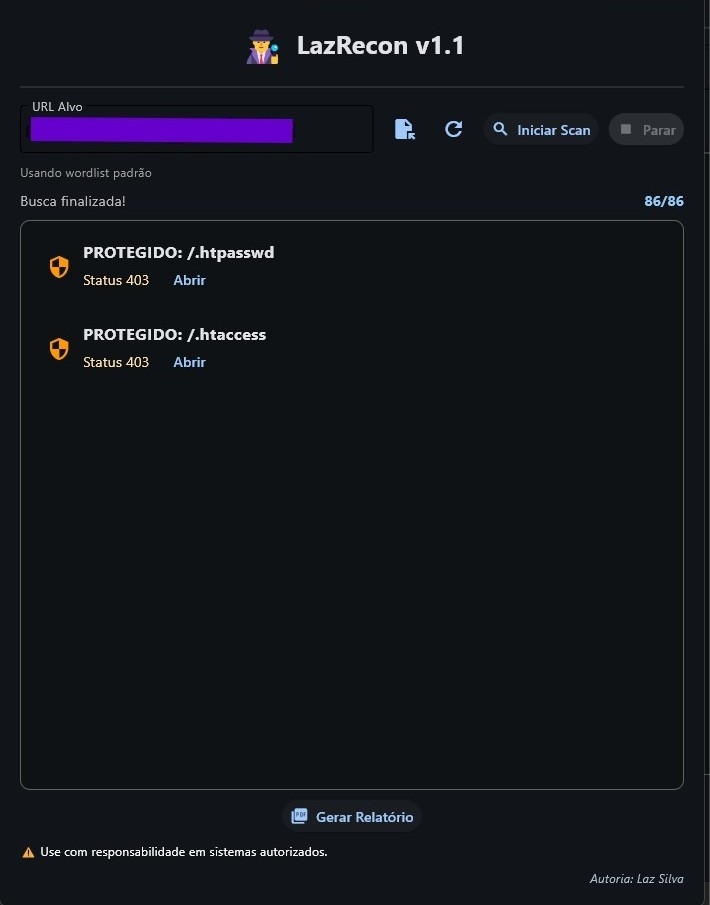

 # 🕵️ LazRecon
 
<p align="center">
  
</p>

<p align="center">
  
  
</p>

**LazRecon** é uma ferramenta de reconhecimento ativo e fuzzer de caminhos web. 

> 💡 **Origem:** O projeto nasceu de um script pessoal desenvolvido para automatizar e facilitar o mapeamento de diretórios, evoluindo para uma aplicação estável com interface gráfica (GUI) e suporte a relatórios técnicos.
---

## 🎯 Proposta
O projeto prioriza a **objetividade**. É uma solução enxuta desenhada para identificar vetores de ataque e caminhos sensíveis em segundos, sem a complexidade de grandes suítes de pentest.

## 🚀 O que ele faz?

* **Mapeamento Multi-status:** Identifica rotas ativas (200 OK) e restritas (403 Forbidden).
* **Identificação de Arquivos Críticos:** Foco em `.env`, `.htaccess`, `.htpasswd` e backups.
* **Customização de Wordlists:** Liberdade total para o usuário carregar suas próprias listas de termos (.txt), permitindo ataques direcionados e maior precisão.
* **User-Agent Spoofing:** Técnicas para contornar bloqueios básicos de WAF.
* **Relatórios Automáticos:** Exportação dos resultados encontrados diretamente para um arquivo PDF organizado. 

## 🛠️ Tecnologias
* **Python 3.x** 
* **Flet** (Interface Gráfica)
* **Requests** (Engine HTTP)
* **FPDF** (Gerador de Relatórios)
* **Gestão de Dependências:** Poetry

## 📋 Como Instalar e Usar

### 1. Pré-requisitos
* Python 3.10 ou superior
* [Poetry](https://python-poetry.org/docs/#installation) instalado

### 1.1 Clonar o Repositório  
```bash
git clone https://github.com/lazsilvadev/lazrecon.git
```
### Usando Poetry (Recomendado)
```bash
poetry install # Instale as dependências

poetry run python lazrecon.py # Inicie a GUI
```
### Opção 2: Usando Pip (Tradicional)
```bash
python -m venv venv # Cria e ativa o ambiente virtual

source venv/bin/activate  # Linux/Mac
venv\Scripts\activate     # Windows

pip install -r requirements.txt # Instale as dependências
python lazrecon.py # Inicie a GUI
```
### ⚠️ Aviso Legal (Disclaimer)
Este projeto foi desenvolvido exclusivamente para fins educacionais e de estudo. O uso desta ferramenta em sistemas sem autorização prévia é ilegal e de inteira responsabilidade do usuário. **Use com ética.**
